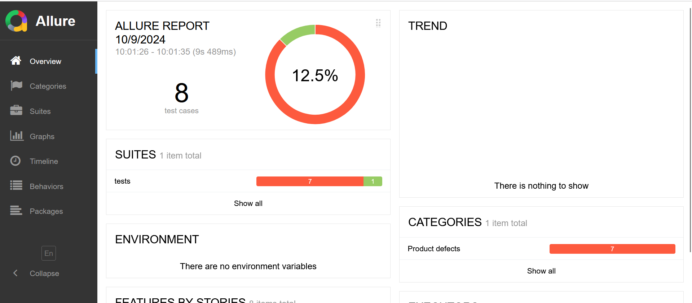

# Restful Booker API Automation using Pytest and Requests Library

### Running the code - 

```
pytest
```

### Generating Test Report - 
```
allure generate allure_results --clean -o allure-report
```

### Screenshots - 
